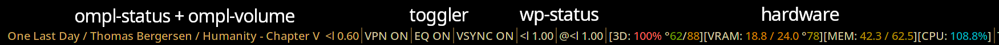

# bsz-i3blocklets
### My own i3blocks widgets/blocklets



## Universal options via `bszi3b-shared.bash` library
Scripts depending on this library will respect all of the following variables when set in the i3blocks config. Scripts that depend on this library **will not run without it.**

Life Pro Tip™®© : Set the colors globally in i3blocks for a coordinated theme.

### Variables 
  * `COLOR_HI` : Color for active/high values. Default `#aa652c`
  * `COLOR_LO` : Color for low/inactive values. Default `#0085c0`
  * `COLOR_ALT` : Color for alternate states. Default `#5c8225`
  * `COLOR_ERR` : Color for urgent/error states. Default `#c14e79`
  * `PREFIX` : Text prepended to long output. Default None
  * `SUFFIX` : Text appended to long output. Default None
  * `PREFIX_SHORT` : Text prepended to short output. Default `$PREFIX`
  * `SUFFIX_SHORT` : Text appended to short output. Default `$SUFFIX`


## hardware
Displays GPU, Memory, and CPU utilization with pretty colors. Does NOT use `bszi3b-shared.bash`

### Requirements
  * **`markup=pango` set in i3blocks config**
    * strongly recommend you also set `interval=repeat` and control speed using `RATE`
  * `bash` + the gnu tools most sane distros have by default

### Variables
  * `RATE` : How long it measures utilization per output. Default `1.0`
  * `THERMAL_FLOOR` : All thermal text starts getting warmer above this value. Default `25` aka 77°F
  * `CPU_THERMALS` : Also display CPU Tctl/Core max thermals. Default`false`
  * `CPU_THERMAL_CEIL` : CPU thermal text is hottest at this value. Default `100`
  * `GPU` : Enables GPU monitoring. Default `true`
    * probably only works on AMD cards
  * `GPU_ID` : Which card to monitor. Default `0`
  * `GPU_THERMALS` : Also display GPU Core/Junction/Memory thermals. Default `false`
    * Ceil taken directly from reported critical temperature
  * `GPU_POWER` : Also display GPU power in watts. Default `false`

  * `SEPARATOR` : Separator between categories on long output. Default `][`
  * `SEPARATOR_SHORT` : Separator between categories on short output. Default ` `
  * `SEPARATOR_THERMAL` : Separator before thermal values. Default ` °`
  * `SEPARATOR_POWER` : Separator before power value. Default ` ⌁`
  * `PREFIX` : Text prepended to long output. Default `[`
  * `SUFFIX` : Text appended to long output. Default `]`
  * `PREFIX_SHORT` : Text prepended to short output. Default None
  * `SUFFIX_SHORT` : Text appended to short output. Default None


## toggler
Simple widget for toggling anything

### Requirements
  * **bszi3b-shared.bash**

### Variables
  * `CMD_STATUS` : Command run to query status. Required
  * `RE_STATUS` : Regular expression to determine status state. Required
  * `CMD_ON` : Command to run when left clicked. Optional
  * `CMD_OFF` : Command to run when right clicked. Optional

### Controls
  * LMB : Run `CMD_ON`
  * RMB : Run `CMD_OFF`

### Example
```
[bsz/toggler]
interval=5
PREFIX=OMPL Status: 
CMD_STATUS=ompl print playing
RE_STATUS=true
CMD_ON=ompl play
CMD_OFF=ompl stop
```


## wp-status
Displays and controls volume for WirePlumber

### Requirements
  * **bszi3b-shared.bash**

### Controls
  * Scroll Up : Increase volume
  * Scroll Down : Decrease volume
  * LMB : Toggle mute
  * RMB : Reset volume to 1.0

### Variables
  * `DEVICE` : Device ID to use. Default `@DEFAULT_AUDIO_SINK@`
  * `PREFIX` : Prefix applied to all icons. Default none. Handy for running a 2nd time for source

  * `ICON_LO` `ICON_MID` `ICON_HI` `ICON_MUTE` : icons to display for different Volume levels. Defaults...
    * `ICON_LO` : "< "
    * `ICON_MID` : "<l "
    * `ICON_HI` : "<ll "
    * `ICON_MUTE` : "<X "


## ompl-status
Displays a given tagstring with playback controls for the OMPL music player

### Requirements
  * **bszi3b-shared.bash**
  * [OMPL](https://github.com/Beinsezii/ompl)

### Controls
  * LMB : Play/pause
  * RMB: Stop
  * Scroll Up: Next track
  * Scroll Down: Previous track

### Variables
  * `TAGSTRING` : Long tagstring display. Defaults to OMPL's statusline if unset
  * `TAGSTRING_SHORT` : Short tagstring display. Default `title`

  * `VOL_SIGNAL` : If set to a signal number, will trigger the appropriate i3blocks widget every iteration. Intended for ompl-volume.

  * `ICON_PAUSE` `ICON_PLAY` `ICON_STOP` : icons to display for different player states. All default to `""`


## ompl-volume
Displays and controls volume for the OMPL music player

If using with `ompl-status`, recommended you set `interval=0` and use `VOL_SIGNAL` to reset the widget instead.

### Requirements
  * **bszi3b-shared.bash**
  * [OMPL](https://github.com/Beinsezii/ompl)

### Controls
  * LMB/Scroll Up : Increase volume
  * RMB/Scroll Down : Decrease volume

### Variables
  * `ICON_LO` `ICON_MID` `ICON_HI` : icons to display for different Volume levels. Defaults...
    * `ICON_LO` : "< "
    * `ICON_MID` : "<l "
    * `ICON_HI` : "<ll "


# Archived

## nvidia
Displays GPU utilization, hardware video decoder utilization, and memory usage.

**Archived because I no longer have an nvidia gpu.**

### Requirements
  * GNU `bash`
  * `nvidia-smi`

### Variables
  * `GPU_ID` : Which GPU to fetch stats from. Default `0`
  * `SEPARATOR` : Separates different fields in long display. Default `|`
  * `COLOR_IDLE` : Hex code for color displayed when GPU is idle. Default `#2EAFFF`
  * `COLOR_ERROR` : Hex code for error message color. Default `#FF898E`


## easyeffects-toggle
Simple widget for EasyEffects global bypass

**Archived in favor of using [toggler](https://github.com/Beinsezii/bsz-i3blocklets#toggler) directly**
<!-- realtalk how tf do I reference #toggler locally. #toggler ./#toggler etc dont work../ -->

### Variables
  * `COLOR_ON` : Color when on (no bypass)
  * `COLOR_OFF` :  Color when off (bypass enabled)
  * `COLOR_ERROR` : Color if anything else happens

### Controls
  * LMB : Turn on (disable bypass)
  * RMB : Turn off (enable bypass)


## F.A.Q.
Question|Answer
---|---
WTF about [i3blocks-widgets-rs](https://github.com/Beinsezii/i3blocks-widgets-rs)???|Discontinued. Future updates will go here. Having to recompile everything just to change a regex pattern was pain. Writing the code was easier, deploying was way harder.
Some of these already exist in [i3blocks-contrib](https://github.com/vivien/i3blocks-contrib) you fucking waste of clock cycles. By creating your own repository that makes little of all those who came before you, not only do you smear their name by indirectly saying their contributions aren't good enough for you, but you also show little regard for the current climate crisis with your blatant disrepesct for thermoelectric efficiency. In fact this whole project reeks of "I'm ignorant to the current socio-economic and political happenings of the world". You were so busy trying to be a wolf that you wrapped back around into becoming a sheep. It's so pathetic I almost pity you. Almost.|strawman ouroboros
